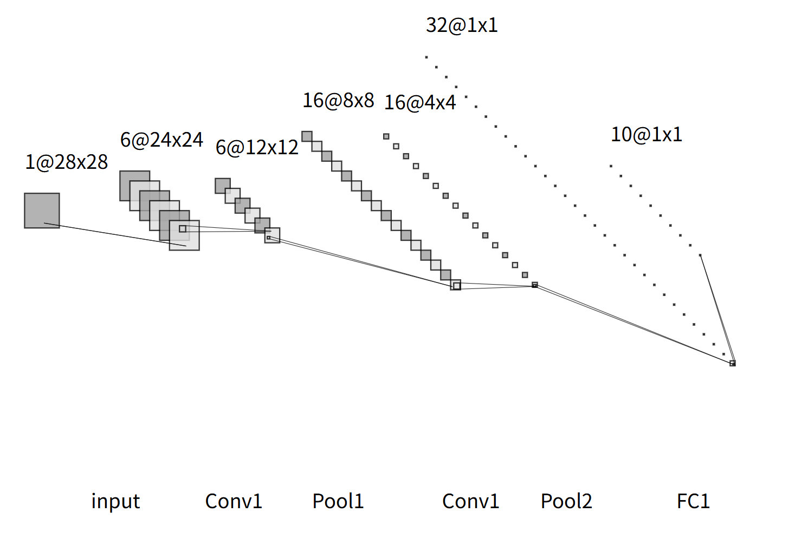
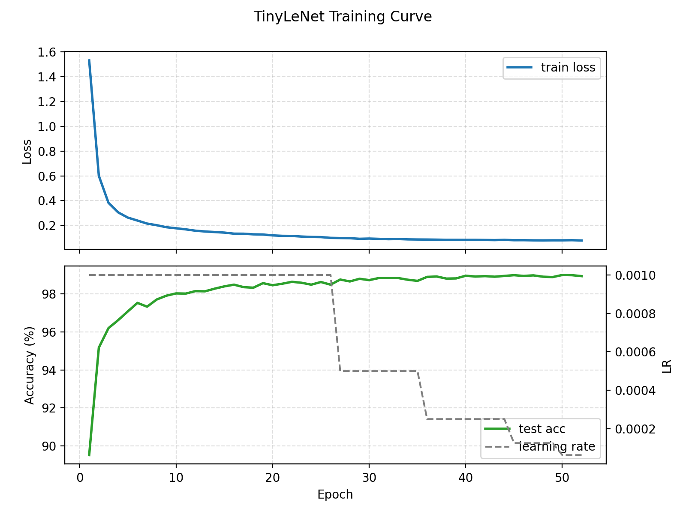
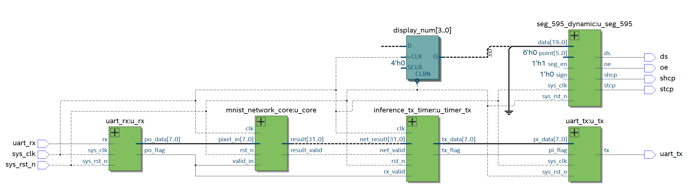
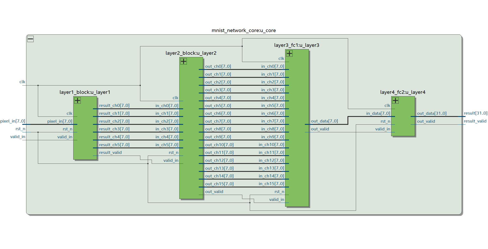

# FPGA_MNIST - 基于 FPGA 的 MNIST 手写数字识别系统

[]()
[]()
[]()

> 在资源仅有 10K 逻辑单元的入门级 FPGA 上实现端到端 CNN 推理加速器

版本状态: **Completed / Pure Verilog**
说明: 主线为纯 Verilog 硬件加速器，Nios II 版本仅为早期测试。

> 💡 **技术路线说明**：本项目早期尝试使用 Nios II 软核实现（v1），但因资源限制与性能瓶颈最终转向纯 Verilog 硬件加速方案（v1.1）。详见 [Nios II 实现路线详解（README_v1.md）](README_v1.md)

---

## 🎯 项目亮点

### 核心特性
- **极限资源利用**：在 EP4CE10（10K LEs）上实现完整 CNN，资源利用率达 **97.15%**
- **高精度量化**：INT8 定点量化，精度损失仅 **0.29%**（浮点 99.00% → 量化 98.71%）
- **低延迟推理**：纯计算时间 **10.031 ms**，端到端（含串口）**77.885 ms**
- **软硬协同**：Python 训练量化 + Verilog 硬件加速的完整工作流

### 技术实现

#### 网络架构

本设计采用 TinyLeNet（简化版 LeNet-5）网络架构：

<div align="center">

<p><i>图 1: TinyLeNet 网络拓扑结构 - 从左至右依次为输入层、两层卷积池化层及两层全连接层</i></p>
</div>

**网络层级详解**：
- **Layer1**: Conv 6@5×5 + ReLU + Pool (28×28 → 12×12×6)
- **Layer2**: Conv 16@5×5 + ReLU + Pool (12×12×6 → 4×4×16)
- **Layer3**: FC1 (256 → 32) + ReLU
- **Layer4**: FC2 (32 → 10)

#### 训练与验证

<div align="center">

<p><i>图 2: 神经网络训练过程曲线 - 上图为训练损失收敛情况，下图为测试集准确率与学习率的变化关系</i></p>
</div>

**训练策略**：
- 在第 27、36、45 个 Epoch 实施学习率衰减（Learning Rate Decay）
- 每次学习率降低时，测试集准确率均出现提升
- 最终在第 50 个 Epoch 达到 **99.00%** 的浮点精度

#### 硬件架构

- **串行 MAC（乘累加）架构**，资源共享策略
- **64-bit 宽位宽累加器**，防止定点溢出
- **状态机控制的流水线设计**
- **帧缓存 + 滑动窗口**的卷积实现

<div align="center">

<p><i>图 3: 系统顶层模块（mnist_system_top）RTL 视图 - 展示 UART 接口与神经网络核心的连接关系</i></p>
</div>

<div align="center">

<p><i>图 4: 神经网络计算核心（mnist_network_core）RTL 视图 - 四层网络模块的级联结构</i></p>
</div>

#### 量化策略

- **8-bit 数据位宽**（输入、权重、激活值）
- **定点量化公式**：

$$
y_q = \text{clamp}\left(\left\lfloor\frac{\text{acc} \cdot \text{mult} + \text{round}}{2^{\text{shift}}}\right\rfloor, -128, 127\right)
$$

- **量化参数统一管理**（`quant_params.vh`）
- **精度保持**：INT8 量化后准确率 98.71%，损失仅 0.29%

#### 板级验证

<div align="center">


<p><i>图 5 & 6: FPGA 板级验证实测效果 - 左图识别数字 1，右图识别数字 7，数码管实时显示推理结果</i></p>
</div>

**验证指标**：
- ✅ **推理延迟**：10.031 ms（FPGA 实测）
- ✅ **串口通信**：115200 bps 稳定传输
- ✅ **准确率**：与 Python 参考模型一致（98.71%）
- ✅ **数码管显示**：实时显示识别结果

### 资源占用（EP4CE10F17C8）
| 资源类型 | 使用量 | 总量 | 利用率 |
|---------|--------|------|--------|
| 逻辑单元 (LCs) | 10,026 | 10,320 | **97.15%** |
| 存储块 (M9K) | 26 | 46 | 56.5% |
| 乘法器 (DSP) | 16 | 23 | 69.5% |

### 性能指标
- **推理延迟**：10.031 ms（纯计算）/ 77.885 ms（含串口传输）
- **时钟频率**：50 MHz（注：当前时序 WNS = -2.745 ns，需降频或增加流水级）
- **UART 波特率**：115200 bps
- **功耗**：低功耗边缘推理方案

---

## 📚 快速入口
- **硬件实现详细文档**: [hardware/src/v1.1/README.md](hardware/src/v1.1/README.md)
- **Python 工具链**: [model_tools/README.md](model_tools/README.md)
- **Nios II 技术路线说明** (Legacy): [README_v1.md](README_v1.md)

---

## 📂 目录结构

```
FPGA_MNIST_Nios/
├── README.md                    # 本文件
├── README_v1.md                 # Nios II 实现路线说明（Legacy）
├── model_tools/                 # Python 工具链
│   ├── calc_quant_params.py    # 量化参数计算
│   ├── quantize_bias.py        # 偏置量化
│   ├── export_test_img.py      # 测试图像导出
│   ├── hw_ref.py               # 硬件等效参考推理
│   ├── batch_sim.py            # 批量仿真
│   ├── send_image.py           # 串口发送工具
│   └── README.md
├── hardware/src/v1.1/          # 纯 Verilog 主线（推荐）
│   ├── rtl/                    # Verilog 源码
│   │   ├── mnist_system_top.v # 系统顶层
│   │   ├── mnist_network_core.v # 网络核心
│   │   ├── layer1_block.v      # 卷积层 1
│   │   ├── layer2_block.v      # 卷积层 2
│   │   ├── layer3_fc1.v        # 全连接层 1
│   │   ├── layer4_fc2.v        # 全连接层 2
│   │   └── weights/            # 权重 ROM 初始化文件
│   ├── tb/                     # 仿真测试平台
│   ├── script/                 # 仿真脚本
│   └── README.md
├── hardware/src/v1/            # Legacy Nios II 版本
└── software/                   # Legacy Nios II 软件
```

---

## 🚀 快速开始

### 1. 环境准备
- **硬件**：Intel Cyclone IV EP4CE10 开发板
- **软件**：
  - Quartus Prime（综合与布局布线）
  - Icarus Verilog + Surfer（仿真）
  - Python 3.x + PyTorch（模型训练与量化）

### 2. 生成量化参数与权重
```bash
# 计算量化参数（含 normalize）
python model_tools/calc_quant_params.py --normalize

# 生成 INT32 偏置 ROM
python model_tools/quantize_bias.py \
    --quant-params model_tools/quant_params.json \
    --out-dir hardware/src/v1.1/rtl/weights

# 导出测试图像
python model_tools/export_test_img.py \
    --normalize \
    --quant-params model_tools/quant_params.json
```

### 3. 仿真验证
```bash
# Python 参考推理（Golden Reference）
python model_tools/hw_ref.py \
    --image hardware/src/v1.1/tb/test_image.mem \
    --weights hardware/src/v1.1/rtl/weights \
    --quant-params model_tools/quant_params.json

# RTL 仿真
python hardware/src/v1.1/script/run_sim.py \
    --tb tb_mnist_network_core \
    --no-wave

# 批量测试（准确率评估）
python model_tools/batch_sim.py \
    --count 10000 \
    --normalize \
    --quant-params model_tools/quant_params.json \
    --quiet
```

### 4. 上板验证
```bash
# 1. 使用 Quartus 综合 mnist_system_top.v 并下载 .sof 到 FPGA
# 2. 通过 UART 发送图像并接收结果
python model_tools/send_image.py
```

> 💡 **提示**：板级验证实测效果见上方"技术实现 - 板级验证"章节的图片展示。

---

## 📊 模块说明

### 核心计算模块
| 模块名称 | 功能 | LCs | M9K | DSP |
|---------|------|-----|-----|-----|
| `layer1_block` | Conv1 + Pool1 | 2,356 | 3 | 5 |
| `layer2_block` | Conv2 + Pool2 | 3,664 | 7 | 5 |
| `layer3_fc1` | 全连接层 1 | 2,846 | 11 | 5 |
| `layer4_fc2` | 全连接层 2 | 622 | 4 | 1 |
| **总计** | 网络核心 | **9,438** | **25** | **16** |

### I/O 与控制模块
- `uart_rx`/`uart_tx`：串口通信（115200 bps）
- `inference_tx_timer`：推理计时与结果打包
- `seg_595_dynamic`：数码管显示（驱动 74HC595）

---

## ⚠️ 已知限制与技术展望

### 当前技术限制
1. **时序约束**：50 MHz 下 Setup WNS = -2.745 ns
   - **缓解方案**：降低时钟频率至 40 MHz，或增加关键路径流水级
   - **根本解决**：迁移至更大规模 FPGA 以获得更多布线资源

2. **通信带宽瓶颈**：115200 bps 串口传输 784 字节需 ~68 ms
   - **改进方案**：提升波特率至 921600 bps（减少至 ~8.5 ms）
   - **替代方案**：采用并行接口（SPI/并行总线）或 DMA 传输

3. **资源饱和约束**：97.15% LCs 占用限制架构扩展空间
   - **平台升级**：迁移至 Cyclone V（85K LEs）或 Zynq-7000（ARM+FPGA）
   - **应用场景**：当前设计已达 EP4CE10 性能极限，适合作为教学与概念验证

### 潜在研究方向

基于本项目的技术积累，以下方向具有进一步探索价值：

**架构优化**：
- **脉动阵列（Systolic Array）**：引入空间并行计算结构，可将卷积层吞吐率提升 5-10 倍，但需要更大的 FPGA 资源（预计 50K+ LEs）
- **多层流水线**：在层间插入流水级，实现连续图像的高吞吐处理（适用于视频流场景）

**应用扩展**：
- **实时视觉系统**：集成 OV7670 摄像头模块，实现端到端的实时手写数字识别（需额外 3-5K LEs 用于图像预处理）
- **边缘智能设备**：结合低功耗设计技术，应用于便携式设备或嵌入式系统

**算法研究**：
- **动态量化**：探索运行时量化策略，在精度与性能间动态平衡
- **混合精度推理**：对不同层使用不同位宽（4/8/16-bit），优化资源利用率与准确率的权衡
- **模型压缩**：研究剪枝、知识蒸馏等技术，进一步降低模型复杂度

**说明**：以上方向均为技术可行性探讨，实际实现需要根据具体应用场景和资源约束进行评估。

---

## 📖 参考资料

### 学术论文
- **LeCun et al., "Gradient-Based Learning Applied to Document Recognition"**, *Proceedings of the IEEE*, 1998
- **Jacob et al., "Quantization and Training of Neural Networks for Efficient Integer-Arithmetic-Only Inference"**, *CVPR*, 2018

### 技术文档
- **Intel Cyclone IV Handbook**: [链接](https://www.intel.com/content/www/us/en/programmable/documentation/lit-index.html)
- **野火 EP4CE10 开发板文档**: [链接](https://doc.embedfire.com/fpga/altera/ep4ce10_pro/zh/latest/index.html) - Cyclone IV EP4CE10 开发板详细教程（中文）

### 相关资源
- **MNIST Database**: [http://yann.lecun.com/exdb/mnist/](http://yann.lecun.com/exdb/mnist/)
- **PyTorch Quantization Tutorial**: [链接](https://pytorch.org/tutorials/advanced/static_quantization_tutorial.html)

---
