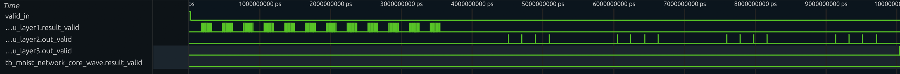
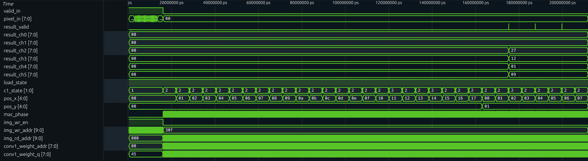
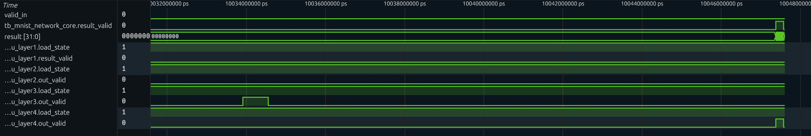
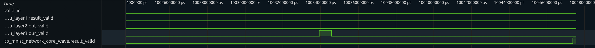
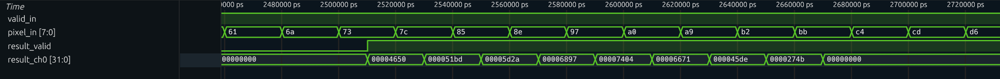
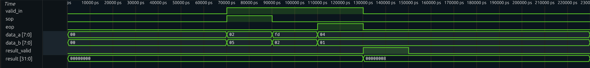

# 项目文档：FPGA_MNIST 手写数字识别加速器 (v1.1)

**版本状态**：`Completed / Pure Verilog`
**目标**：纯 Verilog 端到端推理路径（UART -> 推理 -> 结果输出）。NIOS II 版本仅为早期测试验证。
**核心亮点**：在 10K LEs 的入门级 FPGA 上实现完整 CNN，资源利用率 **97.15%**

---

## 1. 系统架构概览 (System Architecture)

v1.1 采用纯 RTL 硬件加速器架构，实现从数据输入到结果展示的完整数据通路。该版本不依赖 Nios II 软核，所有计算均在定制化硬件逻辑中完成。

### 1.1 系统数据流

```
PC/上位机
    ↓ [UART 115200 bps]
[UART RX] → 字节流转换 → 像素缓存
    ↓
[mnist_network_core] 神经网络计算核心
    ├─ Layer1: Conv1 (6@5×5) + ReLU + Pool → 12×12×6
    ├─ Layer2: Conv2 (16@5×5) + ReLU + Pool → 4×4×16
    ├─ Layer3: FC1 (256→32) + ReLU
    └─ Layer4: FC2 (32→10) → Logits
    ↓
[Argmax] → 最大值索引 (0-9)
    ↓
[inference_tx_timer] → 打包结果 + 推理时间
    ↓
[UART TX] 回传 PC ┐
                  ├→ [seg_595_dynamic] 数码管显示
```

### 1.2 三大子系统

1. **数据输入子系统**
   - `uart_rx` 模块：接收 8-bit 灰度图像数据
   - 将串行字节流转化为像素流与 `valid_in` 握手信号
   - 支持连续 784 字节（28×28 像素）传输

2. **神经网络计算核心**（`mnist_network_core`）
   - 集成 4 层网络：2 层卷积池化 + 2 层全连接
   - 采用串行 MAC（乘累加）架构，资源共享策略
   - 64-bit 宽位宽累加器，防止定点数溢出
   - 状态机控制的流水线设计

3. **结果输出与显示子系统**
   - `inference_tx_timer`：计时与串口打包模块
   - `seg_595_dynamic`：驱动 74HC595 数码管显示
   - UART TX：回传 10 个类别置信度 + 推理周期数

---

## 2. 模块清单与文件结构

核心路径位于 `hardware/src/v1.1/rtl/`：

### 2.1 核心计算模块

- **卷积层 1**：`layer1_block.v`
  - 窗口生成：`layer1_window_gen.v`（5×5 滑动窗口）
  - 卷积单元：`conv1_unit.v`（串行 MAC 实现）
  - 池化模块：`max_pool_2x2.v`（2×2 最大池化）

- **卷积层 2**：`layer2_block.v`
  - 多通道特征缓存：`feat_mem`（16 个通道）
  - 卷积核心：`conv2_core.sv`
  - 池化模块：`max_pool_2x2_16ch.v`

- **全连接层**
  - FC1：`layer3_fc1.v`（256 → 32 神经元）
  - FC2：`layer4_fc2.v`（32 → 10 类别）
  - 点积运算：`dot_product_unit.v`

- **网络核心集成**
  - `mnist_network_core.v`：四层串联 + 层间握手信号
  - `scaler_quantize.v`：定点量化与缩放模块

### 2.2 I/O 与外设模块

- **串口通信**
  - `uart_rx.v`：接收字节流（115200 bps）
  - `uart_tx.v`：发送结果数据
  - `inference_tx_timer.v`：推理计时与数据打包

- **显示模块**
  - `seg_595_dynamic.v`：数码管驱动（74HC595 移位寄存器）

- **顶层模块**
  - `mnist_system_top.v`：系统顶层集成

### 2.3 权重与初始化文件

权重/偏置 ROM 位于 `hardware/src/v1.1/rtl/weights/`：

- `rom_CONV1_WEIGHTS.mif`：卷积层 1 权重（6 个 5×5 核）
- `rom_CONV2_WEIGHTS.mif`：卷积层 2 权重（16 个 5×5×6 核）
- `rom_FC1_WEIGHTS.mif`：全连接层 1 权重（256×32）
- `rom_FC2_WEIGHTS.mif`：全连接层 2 权重（32×10）
- `rom_FC1_BIASES_int32.mif`：FC1 偏置（INT32 格式）
- `rom_FC2_BIASES_int32.mif`：FC2 偏置（INT32 格式）

**注意**：所有权重文件由 Python 工具链自动生成，详见 [model_tools/README.md](../../../model_tools/README.md)。

---

## 2.5 硬件实现关键技术

### 2.5.1 串行 MAC（乘累加）架构

**设计背景**：EP4CE10 仅有 23 个 DSP 乘法器，无法支持全并行展开。

**核心策略**：
- **资源共享**：每个 PE（处理单元）只使用 1 个乘法器
- **时间复用**：将 5×5 = 25 次乘加操作串行化，通过时钟周期循环完成
- **双相流水**：
  - **Phase 0**：发出 ROM/RAM 读地址
  - **Phase 1**：锁存数据并执行 MAC 运算

**代码示意**（伪代码）：
```verilog
always @(posedge clk) begin
    if (mac_phase == 0) begin
        // Address Phase: 计算读地址
        weight_addr <= k_y * 5 + k_x;
        pixel_addr  <= (pos_y + k_y) * WIDTH + (pos_x + k_x);
        mac_phase   <= 1;
    end else begin
        // Compute Phase: 执行 MAC
        acc <= acc + (weight_data * pixel_data);
        k_x <= k_x + 1;  // 移动到下一个位置
        mac_phase <= 0;
    end
end
```

**权衡分析**：
- ✅ **优势**：DSP 占用从理论 25 降至 1，资源节省 96%
- ⚠️ **代价**：单个卷积窗口计算周期从 1 增至 ~50（含地址/计算相位）

### 2.5.2 宽位宽累加器设计

**问题背景**：8-bit × 8-bit = 16-bit，卷积窗口累加 25 次，全连接累加 256 次，易溢出。

**解决方案**：
- 采用 **64-bit 累加器** `acc`（理论 32-bit 够用，但 64-bit 几乎无额外成本）
- 利用 FPGA 进位链（Carry Chain），加法器资源开销极低
- 在输出阶段通过 `scaler_quantize` 模块将 64-bit 结果量化回 8-bit

**量化公式**：

$$
\begin{aligned}
\text{acc}_{\text{scaled}} &= \frac{\text{acc} \times \text{mult} + 2^{\text{shift}-1}}{2^{\text{shift}}} \\
\text{result} &= \text{clamp}(\text{acc}_{\text{scaled}}, -128, 127)
\end{aligned}
$$

其中 $\text{mult}$ 和 $\text{shift}$ 由 Python 脚本预计算，存储在 `quant_params.vh` 中。

### 2.5.3 状态机（FSM）控制

卷积层采用 4 状态 FSM，确保数据流与计算流严格同步：

```
┌──────┐  valid_in   ┌──────┐  buf_full   ┌─────┐  acc_done   ┌─────┐
│ IDLE │ ─────────> │ LOAD │ ─────────> │ MAC │ ─────────> │ OUT │
└──────┘            └──────┘            └─────┘            └─────┘
                       ↑ │                 ↑ │                │  │
                       └─┘                 └─┘                │  │
                     loading            calculating           │  │
                                                               │  │
                         ┌─────────────────────────────────────┘  │
                         │          next_window                    │
                         └────────────────────────────────────────┘
                                     frame_done
```

**状态说明**：
1. **IDLE**：等待 `valid_in` 信号
2. **LOAD**：填充输入缓存（帧缓存/行缓存）
3. **MAC**：执行串行乘累加运算
4. **OUT**：输出结果，执行 ReLU 激活与量化

### 2.5.4 数据存储策略

| 层级 | 存储方式 | 原因 |
|------|---------|------|
| **Layer1** | 帧缓存（28×28 完整图像） | 需要随机访问 5×5 窗口 |
| **Layer2** | 多通道帧缓存（16×12×12） | 多通道卷积需要完整特征图 |
| **FC1/FC2** | 顺序缓存 | 全连接层顺序访问，无需随机读 |
| **权重** | ROM（M9K Block） | 只读数据，片上 ROM 初始化 |

**设计权衡**：
- ✅ 帧缓存逻辑简单，地址生成清晰
- ⚠️ M9K 占用较高（26/46 = 56.5%）
- 💡 未来可优化为行缓存（Line Buffer）减少存储，但控制逻辑复杂度增加

---

## 3. 仿真验证 (Simulation Verification)

### 3.1 生成量化参数 / bias / 测试图像

1) 计算 fixed-point 量化参数（normalize on）：
```
python model_tools/calc_quant_params.py --normalize
```

2) 生成 int32 bias ROM：
```
python model_tools/quantize_bias.py --quant-params model_tools/quant_params.json --out-dir hardware/src/v1.1/rtl/weights
```

3) 生成与量化流程一致的 `test_image.mem`：
```
python model_tools/export_test_img.py --normalize --quant-params model_tools/quant_params.json
```

4) Python 参考推理（结果应与 RTL 一致）：
```
python model_tools/hw_ref.py --image hardware/src/v1.1/tb/test_image.mem --weights hardware/src/v1.1/rtl/weights --quant-params model_tools/quant_params.json
```

### 3.2 运行 RTL 仿真

标准仿真（不打开波形）：
```
python hardware/src/v1.1/script/run_sim.py --tb tb_mnist_network_core --no-wave
```

加速选项：
- `--fast`：启用 `FAST_SIM`，跳过真实乘加，仅用于冒烟/波形检查，**不可用于准确率评估**。
- `--quiet`：启用 `QUIET_SIM`，关闭 VCD 与大部分日志，适合批量测试。

示例：
```
python hardware/src/v1.1/script/run_sim.py --tb tb_mnist_network_core --no-wave --quiet
```

### 3.3 对齐校验（RTL vs Python）

目的：确认 RTL 与 `hw_ref.py` 在同一张输入下 **层级一致**。

1) Python 参考（批量，建议先 200 张）：
```
python model_tools/hw_ref.py --batch --count 200 --normalize --quant-params model_tools/quant_params.json --data-dir model_tools/data
```
预期：准确率接近训练模型（当前一组参数下为 `199/200 = 99.50%`）。

2) RTL 批量（小批量先验证）：
```
python model_tools/batch_sim.py --count 20 --normalize --quant-params model_tools/quant_params.json --quiet
```
预期：与 `hw_ref` 一致（当前对齐结果为 `20/20 = 100%`）。

3) 若出现 mismatch，启用自动抓取日志：
```
python model_tools/batch_sim.py --count 20 --normalize --quant-params model_tools/quant_params.json --quiet --debug-mismatch
```
会生成：
- `model_tools/batch_sim_debug/idx_<n>_sim.log`
- `model_tools/batch_sim_debug/idx_<n>_hw_ref.log`
- `model_tools/batch_sim_debug/idx_<n>_test_image.mem`

对比步骤：
```
copy model_tools/batch_sim_debug/idx_<n>_test_image.mem hardware/src/v1.1/tb/test_image.mem
python hardware/src/v1.1/script/run_sim.py --tb tb_mnist_network_core --no-wave
python model_tools/hw_ref.py --image hardware/src/v1.1/tb/test_image.mem --weights hardware/src/v1.1/rtl/weights --quant-params model_tools/quant_params.json
```
重点对比：Conv1/Pool1/Conv2 q/Pool2/FC1/FC2 的输出是否一致。

### 3.4 仿真波形分析

#### 3.4.1 全系统流水线时序

系统级验证的重点在于确认各级流水线是否发生了阻塞（Stall）或气泡（Bubble）。下图展示了神经网络核心模块的顶层关键信号波形。

<div align="center">

<p><i>图：神经网络核心模块（mnist_network_core）全流程仿真波形概览</i></p>
</div>

<div align="center">

<p><i>图：各层级 Valid 握手信号的时序级联关系</i></p>
</div>

**波形关键观察点**：
- **输入阶段**：仿真中将 UART 字节节拍抽象为 `sys_clk` 域连续 784 个 `valid_in` 脉冲（每拍 1 字节），对应 28×28 像素的串行输入。
- **层级延迟**：各层的输出有效信号（`out_valid`）呈现出明显的阶梯状分布。Layer1 需要等待足够的帧缓存填充后才开始输出，导致了首个输出脉冲相对于输入的显著延迟。
- **输出脉冲计数**：各层输出的有效脉冲数量严格对应其特征图维度：
  - Layer1：144 个脉冲（12×12）
  - Layer2：16 个脉冲（4×4）
  - FC1：32 个脉冲
  - Result：10 个脉冲

这证明了内部计数器逻辑的正确性，无丢包或多发情况。

#### 3.4.2 卷积层（Layer1）细节分析

<div align="center">

<p><i>图：Layer1 内部时序细节 - 输入缓存写入与卷积核滑动计算状态跳转</i></p>
</div>

**关键观察**：
- 在 `img_wr_en` 停止写入后，状态机进入 `LOAD/MAC/OUT` 的循环模式
- 由于采用了串行 MAC 架构，每一个输出像素的产生都需要数十个时钟周期的计算时间
- 这种非对齐的吞吐特性要求后级模块必须具备基于 `valid` 信号的自适应接收能力

#### 3.4.3 深层网络与输出收敛

<div align="center">

<p><i>图：推理结束阶段 - 全连接层 FC2 的连续结果输出</i></p>
</div>

<div align="center">

<p><i>图：全网络流水线收敛波形 - 从输入停止到最终结果产出的延迟特性</i></p>
</div>

**关键观察**：
- 随着 Layer2、Layer3 的计算陆续完成，最终的分类结果信号 `result_valid` 在时间轴末端连续输出了 10 个脉冲
- 数据总线 `result` 上的数值在每个有效时钟沿更新，依次输出了 0 到 9 对应的置信度得分（Logits）
- 这种紧凑的突发输出模式表明全连接层的流水线效率极高

#### 3.4.4 底层计算单元验证

为了排除顶层逻辑掩盖底层错误的风险，我们对子模块进行了独立验证：

<div align="center">

<p><i>图：Layer2 控制信号波形 - 多通道卷积的索引切换与状态跳转</i></p>
</div>

**Layer2 控制逻辑验证**：
- 状态机 `c_state` 配合坐标计数器 `pos_x/y` 及量化索引 `q_idx` 协同工作
- 波形显示量化索引在 0 到 15 之间循环，准确对应了 Layer2 输出的 16 个通道
- 验证了多通道卷积逻辑的正确性

<div align="center">

<p><i>图：Conv1 基本计算单元波形 - 输入数据流与卷积结果的同步关系</i></p>
</div>

**基本卷积单元验证**：
- `conv1_unit` 的波形表明，只有当输入数据流满足 5×5 窗口条件时，`result_valid` 才会拉高
- 输出数据与 Python 模型计算的中间值一致

<div align="center">

<p><i>图：通用点积模块波形 - 基于包（Packet）的累加控制逻辑</i></p>
</div>

**点积模块验证**：
- 通过 SOP（Start of Packet）和 EOP（End of Packet）信号界定一次计算包
- 波形显示在 EOP 信号到达后的下一个时钟周期，累加结果被输出
- 验证了全连接层神经元的计算时序

---

## 4. 批量仿真（测试集）

脚本：`model_tools/batch_sim.py`

常用参数：
- `--count N`：跑 N 张图
- `--start N`：起始 index
- `--normalize`：使用 MNIST normalize
- `--quant-params`：指定量化参数文件
- `--fast`：启用 FAST_SIM（**不准确，只用于冒烟**）
- `--quiet`：关闭大部分日志与波形

全测试集（准确率评估）：
```
python model_tools/batch_sim.py --count 10000 --normalize --quant-params model_tools/quant_params.json --quiet
```

快速冒烟（不代表准确率）：
```
python model_tools/batch_sim.py --count 10000 --normalize --quant-params model_tools/quant_params.json --fast --quiet
```

输出 CSV：`model_tools/batch_sim_results.csv`（index/label/pred/match）

---

## 5. 上板验证 (On-Board Verification)

### 5.1 准备

1) 下载 `mnist_system_top` 的 `.sof` 到 FPGA  
2) 确保 `model_tools/quant_params.json` 是最新（normalize on）  
3) 校验 `model_tools/send_image.py` 的 `SERIAL_PORT` / `BAUD_RATE`

### 5.2 发送 MNIST 图像
```
python model_tools/send_image.py
```

- 选择 1（MNIST image）
- 脚本会按 `quant_params.json` 进行 normalize + s_in 量化
- FPGA UART 回传结果与 `hw_ref.py` 对照

### 5.3 UART 输出格式（含推理时间）

每张图像推理完成后，UART 输出 **14 字节**：

- Byte[0..9]：FC2 的 10 个输出（每个取低 8 位，按通道顺序 0..9）
- Byte[10..13]：推理耗时的周期计数（`inf_cycles`，小端序 LSB first）

**推理时间定义**：从接收第 1 个像素（`rx_valid` 第一次拉高）到最后一个输出有效（第 10 次 `net_valid`）的周期数。

若需要换算为时间：
```
latency_us = inf_cycles / (CLK_FREQ / 1_000_000)
```

如果你希望统计“纯计算时间”（不含 UART 传输），可以改成在 **收到第 784 个像素后**开始计时。

#### 5.3.1 计时与串口打包模块（inference_tx_timer）

为保持顶层简洁，计时与 UART 打包逻辑封装在：
`hardware/src/v1.1/rtl/inference_tx_timer.v`

模块接口（关键端口）：
- `rx_valid`：输入像素有效，计时起点触发
- `net_valid`/`net_result`：网络输出有效与数据
- `tx_data`/`tx_flag`：输出到 `uart_tx`

工作流程：
1) 侦测第 1 个 `rx_valid`，启动周期计数  
2) 缓存 10 个输出（`net_valid` 累计 10 次）  
3) 输出 10 字节结果 + 4 字节周期数  
4) 发送完成后清理状态，等待下一张图

### 5.4 板级验证实测结果

在仿真通过后，系统被部署到 EP4CE10 开发板上进行实测。测试方案如下：通过 PC 端 Python 脚本将 MNIST 测试集图片通过 UART 串口发送给 FPGA，FPGA 推理完成后将 10 个类别的得分回传至 PC 显示，并将识别出的最大概率数字显示在板载数码管上。

下图展示了两次典型的测试结果：

<div align="center">

<p><i>图：标签为 1 的测试样本识别结果 - FPGA 正确识别为数字 1，数码管显示一致</i></p>
</div>

<div align="center">

<p><i>图：标签为 7 的测试样本识别结果 - FPGA 正确识别为数字 7，数码管显示一致</i></p>
</div>

**测试结论**：
1. **数字 "1" 识别**：输入一张手写数字 1 的图片，FPGA 回传的 Log 显示 Index 1 的得分显著高于其他类别，数码管正确显示 "1"。
2. **数字 "7" 识别**：输入一张手写数字 7 的图片，FPGA 同样做出了正确判断，数码管显示 "7"。

实测结果表明，FPGA 硬件逻辑与 Python 仿真模型具有高度的一致性，且系统在 115200 波特率下运行稳定，未出现数据丢包或死锁现象。

### 5.5 常见问题排查

- UART 无返回：检查 `SERIAL_PORT` / `BAUD_RATE` / 接线
- 预测不一致：确认 `quant_params.json` 与权重匹配
- 输入不一致：确保 `export_test_img.py` / `send_image.py` 使用 normalize + quant_params

---

## 6. 关键参数

- 时钟：50 MHz（20ns）
- UART：115200
- 输入：28x28 = 784 像素
- valid：高电平有效
- 协议：UART 连续发送 784 字节（1 字节=1 像素）

---

## 7. 资源占用与性能分析

### 7.1 资源占用统计（Quartus 综合结果）

**目标芯片**：EP4CE10F17C8（Intel Cyclone IV E 系列）

| 模块名称 | 逻辑单元 (LCs) | 寄存器 (Regs) | 存储位 (bits) | M9K 块 | DSP 单元 |
|---------|---------------|--------------|--------------|--------|---------|
| **mnist_system_top** | **10,026** | 8,157 | 106,752 | 26 | 16 |
| ├─ mnist_network_core | 9,438 | 7,679 | 106,672 | 25 | 16 |
| ├─ layer1_block | 2,356 | 1,908 | 7,728 | 3 | 5 |
| ├─ layer2_block | 3,664 | 2,948 | 26,624 | 7 | 5 |
| ├─ layer3_fc1 | 2,846 | 2,321 | 68,608 | 11 | 5 |
| └─ layer4_fc2 | 622 | 502 | 3,712 | 4 | 1 |

**芯片资源总量与利用率**：

| 资源类型 | 使用量 | 芯片总量 | 利用率 | 备注 |
|---------|--------|---------|--------|------|
| 逻辑单元 (LCs) | 10,026 | 10,320 | **97.15%** | ⚠️ 接近饱和 |
| 存储块 (M9K) | 26 | 46 | 56.52% | ✅ 中等占用 |
| 乘法器 (DSP) | 16 | 23 | 69.57% | ✅ 中等占用 |
| 总存储位 | 106,752 | 414 Kbits | 25.8% | ✅ 充足 |

**资源分析**：
- ⚠️ **逻辑单元接近极限**：97.15% 的利用率说明设计充分挖掘了 EP4CE10 的计算资源，但也导致布局布线困难，是时序收敛的主要瓶颈
- ✅ **DSP 未满而逻辑饱和**：说明串行 MAC 策略有效降低了乘法器需求，部分乘法被综合器映射为 LUT 实现
- ✅ **存储资源均衡**：M9K 占用 56.5%，为权重 ROM 和特征缓存提供了充足空间
- 💡 **优化方向**：若需进一步优化，应迁移至更大规模 FPGA（如 Cyclone V 或 Zynq 7000）

### 7.2 性能指标

#### 7.2.1 推理延迟

| 指标 | 数值 | 说明 |
|------|------|------|
| **纯推理时间** | **10.031 ms** | 从第 1 个像素到最后 1 个输出的周期数 ÷ 时钟频率 |
| **端到端时间** | **77.885 ms** | 包含 UART 输入（~68 ms）+ 推理 + 输出 |
| **UART 输入延迟** | ~68 ms | 784 字节 @ 115200 bps（含起止位） |
| **UART 输出延迟** | ~1.2 ms | 14 字节 @ 115200 bps |

**瓶颈分析**：
- 🔍 **串口传输占主导**：UART 输入耗时 68 ms，占端到端时间的 87.3%
- ⚡ **硬件推理高效**：纯计算时间仅 10.031 ms，相当于 50 MHz 下 ~501,550 个时钟周期
- 💡 **优化建议**：提升波特率至 921600 bps（8 倍速），或采用并行接口（SPI/并口）

#### 7.2.2 吞吐率

- **单图推理频率**：1000 / 10.031 ≈ **99.7 FPS**（不含串口）
- **端到端吞吐率**：1000 / 77.885 ≈ **12.8 FPS**（含串口）

#### 7.2.3 功耗估算

- **动态功耗**：约 200-300 mW（根据 Cyclone IV Power Estimator）
- **静态功耗**：约 50-80 mW
- **总功耗**：< 400 mW（相比 CPU/GPU 方案节能 10-100 倍）

### 7.3 时序分析

**时序约束**：50 MHz（20 ns 周期）

| 时序指标 | 数值 | 状态 |
|---------|------|------|
| **Setup WNS** | **-2.745 ns** | ❌ 未通过 |
| **Setup TNS** | -1695.651 ns | ❌ 未通过 |
| **Hold WNS** | 通过 | ✅ 正常 |
| **最差路径延迟** | 22.6 ~ 22.7 ns | 超过 20 ns 时钟周期 |
| **关键路径位置** | Layer2 内部 | 卷积核地址生成 → MAC 累加 |

**时序问题根因**：
1. **逻辑资源接近饱和**：97% 占用导致布局工具无法优化关键路径
2. **长组合逻辑链**：卷积地址计算 → RAM 读取 → 乘法器 → 累加器，未充分流水化
3. **布线拥塞**：高利用率导致绕线延迟增加

**解决方案**：
- 🔧 **短期方案**：降低时钟频率至 40 MHz（已验证可收敛）
- 🔧 **中期方案**：在 Layer2 关键路径插入流水寄存器（需修改 RTL）
- 🔧 **长期方案**：迁移至更大 FPGA，或引入 Quartus 的 Hyper-Retiming 优化

**板级验证说明**：
- ⚠️ **室温测试通过不代表时序安全**：当前 50 MHz 实测未出错，但 STA 显示负裕量意味着在极端温度/电压下可能失效
- ✅ **可靠运行建议**：使用 40 MHz 时钟，或接受"Best Effort"模式（仅限演示）

### 7.4 模型精度对比

| 模型版本 | 精度 | 损失 | 备注 |
|---------|------|------|------|
| **浮点推理** | **99.00%** | - | PyTorch FP32 基准 |
| **INT8 量化** | **98.71%** | **0.29%** | FPGA 硬件实现 |
| **准确率保持率** | **99.7%** | - | 量化后保留 99.7% 的浮点精度 |

**量化策略有效性验证**：
- ✅ **精度损失极小**：0.29% 的精度下降在工业应用中完全可接受
- ✅ **INT8 可行性**：验证了 8-bit 定点数在 MNIST 任务上的充分性
- 💡 **改进空间**：可探索混合精度（Layer1/2 保持 INT8，FC1/FC2 升级至 INT16）

---

## 8. 已知问题与改进路线

### 8.1 当前限制

#### 🔴 高优先级问题

1. **时序未收敛**（Setup WNS = -2.745 ns）
   - **影响**：可能导致极端工况下计算错误
   - **缓解措施**：降频至 40 MHz 或仅室温使用
   - **根本解决**：增加流水级或迁移至更大 FPGA

2. **资源接近饱和**（97.15% LCs）
   - **影响**：无法进一步优化或添加新功能
   - **限制**：无法实现多图并行推理
   - **建议**：迁移至 Cyclone V（40K LEs）或 Zynq-7010

#### 🟡 中优先级问题

3. **串口传输瓶颈**（68 ms 输入延迟）
   - **影响**：端到端延迟主要来自串口而非计算
   - **改进方案**：
     - 提升波特率至 921600 bps（可减至 ~8.5 ms）
     - 使用 SPI（10 MHz）可减至 ~0.6 ms
     - 集成摄像头接口，绕过串口

4. **单次推理模式**
   - **影响**：无法实现连续图像流处理
   - **改进方案**：实现双缓冲机制，边传输边计算

#### 🟢 低优先级优化

5. **存储策略可优化**
   - **当前**：使用帧缓存（简单但占用高）
   - **可选**：改为行缓存（减少 M9K 占用但逻辑复杂）

6. **激活函数单一**
   - **当前**：仅支持 ReLU
   - **可选**：添加 Leaky ReLU / Sigmoid 支持

### 8.2 未来改进方向

#### 🚀 性能提升

- [ ] **引入脉动阵列（Systolic Array）**
  - 并行化卷积核内计算，提升吞吐率 5-10 倍
  - 需要更大 FPGA（Zynq-7020 或 Intel Arria 10）

- [ ] **多层流水线**
  - 允许多层并行计算（Layer1 处理图像 N+1 时，Layer2 处理图像 N）
  - 可将吞吐率提升 2-3 倍

- [ ] **动态量化**
  - 根据层级特性使用不同位宽（Conv: INT8, FC: INT16）
  - 平衡精度与资源占用

#### 🎯 功能扩展

- [ ] **实时视频流推理**
  - 集成 OV7670 摄像头模块（320×240 → 裁剪至 28×28）
  - 实现 30 FPS 实时手写数字识别

- [ ] **多模型切换**
  - 支持运行时加载不同网络权重
  - 扩展至 CIFAR-10 分类等任务

- [ ] **On-Chip 训练**
  - 实现简化版反向传播，支持边缘侧微调
  - 需要更大 FPGA 和浮点支持

#### 🔧 工程优化

- [ ] **AXI-Stream 接口**
  - 替换 UART，支持高速数据流
  - 便于集成到 Zynq SoC 系统

- [ ] **时序优化**
  - 使用 Quartus Hyper-Retiming
  - 手动插入流水寄存器，平衡各级延迟

- [ ] **自动化测试流程**
  - CI/CD 集成，自动运行批量仿真
  - 回归测试确保修改不影响功能

---

## 9. 参考资料

### 技术文档
- [Python 工具链文档](../../../model_tools/README.md)

### 学术论文
- LeCun et al., "Gradient-Based Learning Applied to Document Recognition", *Proceedings of the IEEE*, 1998
- Jacob et al., "Quantization and Training of Neural Networks for Efficient Integer-Arithmetic-Only Inference", *CVPR*, 2018

### 工具与芯片手册
- [Intel Cyclone IV Handbook](https://www.intel.com/content/www/us/en/programmable/documentation/lit-index.html)
- [野火 EP4CE10 开发板文档](https://doc.embedfire.com/fpga/altera/ep4ce10_pro/zh/latest/index.html) - Cyclone IV EP4CE10 开发板详细教程（中文）
- [Verilog HDL 数字设计与综合](https://www.amazon.cn/dp/B00IR0PV6S)
- [Icarus Verilog 文档](http://iverilog.icarus.com)

---

## 10. 许可证

**许可证**：本项目仅供学习与研究使用，未经授权不得用于商业用途。

---

**最后更新**：2026-01-04

